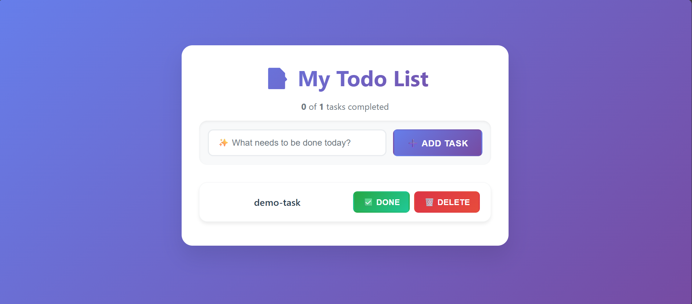

📝 Redux To-Do App

A sleek and modern to-do list application built with React, Redux Toolkit, and Vite. This project highlights scalable state management, lightning-fast development with Vite, and a responsive user interface.

DEMO:

🚀 FEATURES: 
✅ Add, edit, delete tasks

✔️ Mark tasks as completed

🔍 Filter tasks by status: All, Active, Completed

💾 Persistent state using Redux

⚡ Hot Module Replacement (HMR) via Vite

🧹 Code linting with ESLint

🧰 Built using a modern tech stack (React + Vite)

🛠️ Getting Started
Prerequisites
Node.js (v16 or higher)

npm or yarn

Installation
Clone the repository:

bash
Copy
Edit
git clone https://github.com/subhratagarwal/To-do-app.git
cd To-do-app
Install dependencies:

bash
Copy
Edit
npm install
# or
yarn install
Start the development server:

bash
Copy
Edit
npm run dev
# or
yarn dev
Open your browser and visit:
http://localhost:5173

📁 Project Structure
bash
Copy
Edit
src/
├── components/       # Reusable React components
├── features/         # Redux slices and logic
├── styles/           # CSS or styling files
├── App.jsx           # Main app component
├── main.jsx          # Entry point
└── store.js          # Redux store setup
📜 Available Scripts
Command	Description
npm run dev	Start development server
npm run build	Build for production
npm run preview	Preview production build
npm run lint	Run ESLint

🧱 Built With
React – UI Library

Redux Toolkit – State Management

Vite – Lightning-fast bundler

ESLint – Code linting and formatting

⚙️ Customization Tips
ESLint
Pre-configured for basic React rules.

To add custom rules or TypeScript support, visit the typescript-eslint docs.

TypeScript
For type safety, you can migrate to TypeScript.

Refer to the official Vite + React + TypeScript template.

🚀 Deployment
Build the app:

bash
Copy
Edit
npm run build
Preview the production build locally:

bash
Copy
Edit
npm run preview
Deploy the dist folder to any static hosting provider:

Vercel

Netlify

GitHub Pages

🤝 Contributing
Contributions are welcome!
Feel free to:

Fork the repo

Open issues

Submit pull requests

📄 License
This project is licensed under the MIT License.

📚 Acknowledgements
Vite Documentation

Redux Toolkit Docs

React Documentation

💬 Need Help?
Open an issue in the GitHub repository for questions or bug reports.

